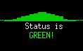
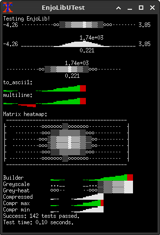

# EnjoLib
Basic thin C++ libraries with focus on utility, portability, short compilation time and backward compatibility.

Static polymorphism is prefered over template-based polymorphism, mainly due to the compilation time burden, that the template solutions typicaly impose (although they don't always have to: see for example the `lib/Template/SafePtr*.hpp` or `lib/Template/Array.hpp` templates).

# Screenshots

## A little bit or history
The library had been originally written as a common part of [my modules](http://enderspace.de/projects/programs_en.php), extending the functionality of [Orbiter Spaceflight Simulator](http://orbit.medphys.ucl.ac.uk/), and was originally developed [here](http://sf.net/p/enjomitchsorbit). In the following years, I found other mad uses of the library, so I extracted it from there. Occasionally I will make efforts of retaining the backward compatibility with the previous repository and backport the new features from this repo.  

# Licensing
Copyright: Szymon Ender and other contributors (see individual files)
License: **mostly** BSD-3, GPL v.2 & GPL v.3. See below:

Although the majority of the project is BSD-licensed, some specific parts are GPL-licensed. Please take note of the copyright notices of the headers of the classes, that you'd like to reuse in other projects. In near future, the copyleft GPL code shall be extracted into a seperate library, which will be GPL-only. Currently the classes awaiting for this extraction are:
- Prof. Buckard's numerical classes under `lib/Math/Burkardt`
- `GreatCircleMath` (TODO: point directly to them)
- (TODO: Other?)
Unfortunatly it's not as easy as just moving them outside of the current directory.

There are liberal alternatives to Prof. Buckard's algos, which are still of log(n) complexity, while his are of sub-log(n) complexity. The only algo, that has no alternatives for now is Nelder-Mead, but it can be achieved simpler by looping all the dimensions independently in a loop.

You may find the [licenses here](docs/licensing/).

# Building
Run `./ci-default.sh` from the root tree.

# Contributing
If you'd like to contribute to the project, please read [CONTRIBUTING](docs/CONTRIBUTING.md) and optionally [AUTHORS_PHILOSOPHY]
(docs/AUTHORS_PHILOSOPHY.md)

